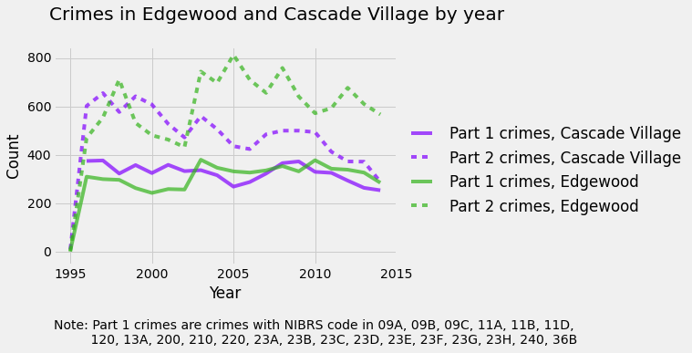

# Cascade Village and Edgewood crime analysis

A few new notebooks documenting the process of filtering and plotting the crime data acquired from Summit County. The data is available if anybody is interested, either in its rawest form or in a more geocoded form, just contact Carter or April, as the full data files were not uploaded, given that they are somewhat substantial files. 

View the notebooks on [nbviewer](www.nbviewer.ipython.org/github/PovertyCenterCLE/akron_sales/), and feel free to give us ideas on what you'd like to see from the data!

The graph looks like:

